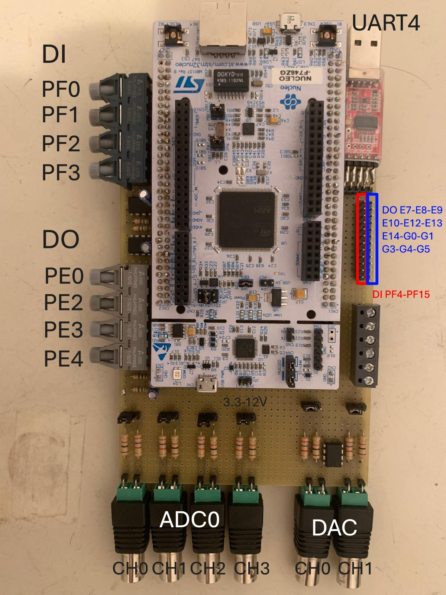
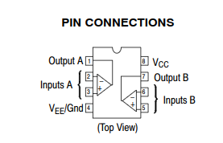
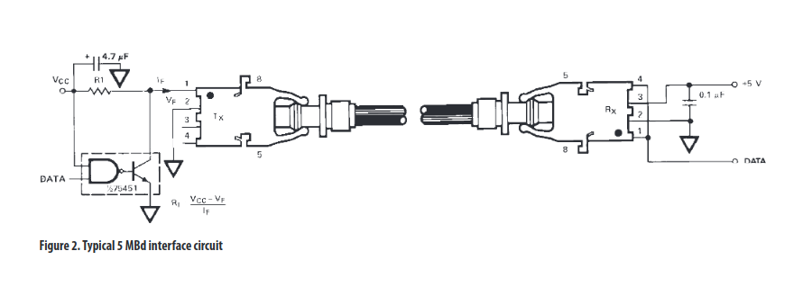
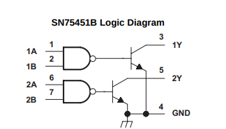
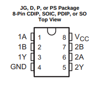

# Project 1

### PCB Description

As in the figure above we have 4 ADC inputs. The input is normally 0-3.3V when jumper is on the right but it can be set to 0-12V shifting the jumper on the right.
Putting the jumper on the right, the input passes through a partitor of 1k - 2.7k resistors (divided by 3.7)
The ADC have been configured to acquire at a max rate of 10 kHz.
We have also 2 DAC outputs. Same as for the ADC, when jumper is on the left the output is in the range 0-3.3V, while if the jumper is on the right the range is 0-12V.
Putting the jumper on the right, the output passes through an op-amp direct configuration amplifier with 1k and 2.7k resistors (amplified by 3.7). The used op-amp is LM358 OpAmp (a dual op-amp chip). 
Tha DAC have been configured to generate at a max rate of 10 kHz.

The UART4 used for debug has been connected to a serial to USB converter in order to be easily connected to a common computer to receive the debug log messages.
The PF0, PF1, PF2, PF3 outputs have been routed to optical outputs. The selected optical transmitter has been the VL HFBR-1521Z.
The PE0, PE2, PE3, PE4 inputs have been routed to optical inputs. The selected optical receiver has been and HFBR-2521Z.

As specified in the datasheet, the double nand port chip SN75451B has been selected for the transmitter circuit.

